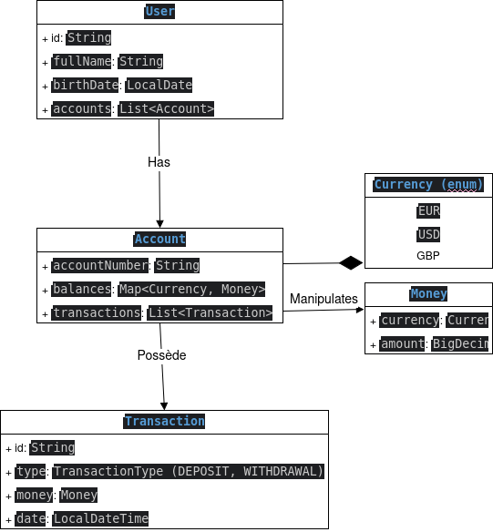

# Bank Account Management Engine (BAME)

# 1. Requirements – Project description and needs assessment

## 1.1 Context

This project involves developing a **bank account management engine** in Java, initially operating via **command line interface (CLI)**. It is situated within a **Fintech** context, with a strong emphasis on **reliability**, **business consistency**, and **code quality**.

The goal is not to produce a simple functional application, but a **robust business foundation**, reusable later in a REST API, a microservice or a distributed system.

---

## 1.2 Educational objectives

* Mastering Business Modeling in Java
* Applying advanced OOP principles
* Properly handling money (BigDecimal, invariants)
* Introducing DDD concepts (Value Object, Aggregate)
* Writing testable and maintainable code

---

## 1.3 Actors

* **User**: bank account owner
* **Banking system**: applies business rules and ensures consistency

---

## 1.4 Functional requirements

### User management

* Create a user
* Uniquely identify a user
* Link one or more accounts to a user

### Account management

* Create a bank account
* Each account has a unique account number
* An account can hold balances in multiple currencies

### Money management

* Deposit money into an account
* Withdraw money from an account
* Check balance by currency
* Prevent negative balances

### History (level 1)

* Record transactions (deposit/withdrawal)
* Retain the date, amount, and currency

---

## 1.5 Non-functional requirements

* Financial accuracy (BigDecimal required)
* Readable and documented code
* Unit tests
* Explicit handling of business errors
* No database dependencies (phase 1)

---

# 2. Class diagram (conceptual)

## 2.1 Overview

The model is based on a few central concepts :

* User: represents a bank client.
* Account: manage the balances and apply the business rules.
* Money (Value Object): represents a valid and unchanging sum of money.
* Currency: represents the supported currencies.
* Transaction: traces a financial transaction.

---

## 2.2 Class descriptions

---

# 3. Architecture

## 3.1 Architectural style

The project adopts a **simplified hexagonal architecture** to clearly separate:

* the core business logic
* the use cases
* the user interface

---

## 3.2 Breakdown into packages

### domain

Contains the core business logic (no technical dependencies)

* User
* Account
* Money
* Currency
* Transaction

### application

Contains use cases

* CreateUserService
* CreateAccountService
* DepositMoneyService
* WithdrawMoneyService

### infrastructure

Technical Implementations

* In-memory repositories
* Identifier generation

### user interface

* CLI (menus, entries, user)

---

## 3.3 Principles applied

* Single Responsibility Principle
* Immutability of Value Objects
* Encapsulation of Business Rules
* Explicit Business Exceptions

---

## 3.4 Scalability

This architecture allows:

* the addition of a REST API without modifying the domain
* the introduction of a database
* data extraction to microservices

---

**End of initial documentation – BAME**
